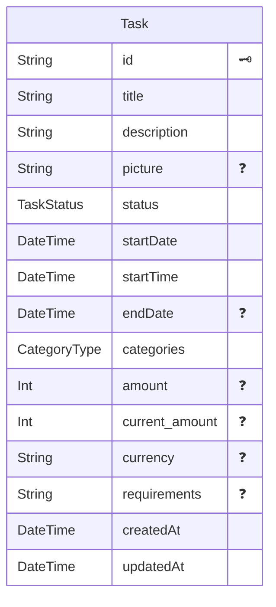

# Task

## Опис
Сутність завдання.

## Таблиця / модель
`Task`

## Поля

| Поле           | Тип    | Nullable | Опис           |
| -------------- | ------ | -------- | -------------- |
| id             | string | ні       | Унікальний ID  |
| title          | string | ні       | Назва          |
| description    | string | так      | Опис           |
| status         | string | ні       | Статус         |
| ownerId        | string | ні       | ID користувача |
| organizationId | string | так      | ID організації |
| createdAt      | string | ні       | Дата створення |
| updatedAt      | string | ні       | Дата оновлення |


## Схема в SQL




```mermaid
sequenceDiagram
    participant F as Frontend
    participant B as Backend
    participant DB as Database

    F->>B: POST /auth/login
    B->>DB: find user by email
    DB-->>B: user
    B-->>F: accessToken + refreshToken + user

    F->>B: POST /auth/refresh
    B->>DB: validate refresh session
    DB-->>B: session valid
    B-->>F: new accessToken